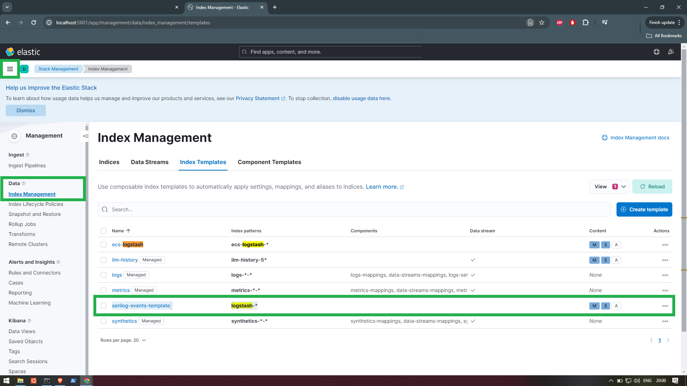
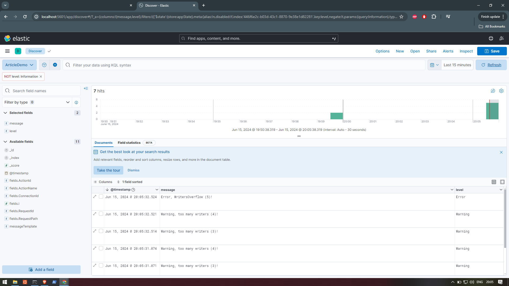

# PT_Demo_Kibana_ElasticSearch

PT_Demo_Kibana_ElasticSearch is a demo that uses the ELK stack.

## Contents
- [Set Docker Containers](#set-docker-containers)
    - [Option 1: Run ELK Docker Containers Directly](#option-1-run-elk-docker-containers-directly)
    - [Option 2: Use Docker-Compose.Yml File](#option-2-use-docker-composeyml-file-recommended)
    - [Access ElasticSearch, Kibana and Logstash](#access-elasticsearch-kibana-and-logstash)
- [Set .NET Application](#set-net-application)
- [Set Kibana UI](#set-kibana-ui)

## Set Docker Containers

0. Create file `logstash.conf` in `/src` directory:

```
input {
  beats {
    port => 5044
  }
}

output {
  elasticsearch {
    hosts => ["http://elasticsearch:9200"]
    index => "logstash-%{+YYYY.MM.dd}"
  }
}
```

### Option 1: Run ELK Docker Containers directly

1. Create Docker Network `elk`:

```
docker network create elk
```

2. Run Docker Container `ElasticSearch`:

```
docker run -d --name elasticsearch --net elk -p 9200:9200 -e "discovery.type=single-node" docker.elastic.co/elasticsearch/elasticsearch:8.5.0
```

3. Run Docker Container `Kibana`:

```
docker run -d --name kibana --net elk -p 5601:5601 -e "ELASTICSEARCH_HOSTS=http://elasticsearch:9200" docker.elastic.co/kibana/kibana:8.5.0
```

4. Run Docker Container `Logstash`:

```
docker run -d --name logstash --net elk -p 5044:5044 -v $(pwd)/logstash.conf:/usr/share/logstash/pipeline/logstash.conf docker.elastic.co/logstash/logstash:8.5.0
```

### Option 2: Use Docker-Compose.Yml File (Recommended)

1. Create new `docker-compose.yml` file in `/src` directory:

```
version: '3.8'
services:
  elasticsearch:
    image: docker.elastic.co/elasticsearch/elasticsearch:8.5.0
    container_name: elasticsearch
    environment:
      - discovery.type=single-node
      - xpack.security.enabled=false
    ports:
      - "9200:9200"
    networks:
      - elk

  kibana:
    image: docker.elastic.co/kibana/kibana:8.5.0
    container_name: kibana
    environment:
      - ELASTICSEARCH_HOSTS=http://elasticsearch:9200
    ports:
      - "5601:5601"
    networks:
      - elk

  logstash:
    image: docker.elastic.co/logstash/logstash:8.5.0
    container_name: logstash
    volumes:
      - ./logstash.conf:/usr/share/logstash/pipeline/logstash.conf
    ports:
      - "5044:5044"
    networks:
      - elk

networks:
  elk:
    driver: bridge
```

2. Run the 3 Docker Containers in a common `elk` network:

```
docker-compose up -d
```

### Access ElasticSearch, Kibana and Logstash

- For ElasticSearch, open your browser and go to http://localhost:9200. You should see a JSON response from Elasticsearch.

- For Kibana, open your browser and go to http://localhost:5601. You should see the Kibana UI.

- For Logstash, check the Logstash logs to ensure it is running correctly:

```
docker-compose logs -f logstash
```

## Set .NET Application

1. Create new blank .NET Solution `PetarTotev.Demo.ElasticSearchKibana`.

2. Create new .NET 8 Web API Project `PetarTotev.Demo.ElasticSearchKibana.EndPoint`.

3. Install the following NuGet packages:

- `Serilog.AspNetCore`
- `Serilog.Sinks.Elasticsearch`

4. In Program.cs, configure Serilog:

```
using Serilog.Sinks.Elasticsearch;
using Serilog;

namespace PetarTotev.Demo.ElasticSearchKibana.EndPoint;

public class Program
{
    public static void Main(string[] args)
    {
        var builder = WebApplication.CreateBuilder(args);

        builder.Services.AddControllers();
        builder.Services.AddEndpointsApiExplorer();
        builder.Services.AddSwaggerGen();

        // Configure Serilog
        Log.Logger = new LoggerConfiguration()
            .Enrich.FromLogContext()
            .WriteTo.Console()
            .WriteTo.Elasticsearch(new ElasticsearchSinkOptions(new Uri("http://localhost:9200")) { AutoRegisterTemplate = true })
            .CreateLogger();

        builder.Host.UseSerilog();

        var app = builder.Build();

        if (app.Environment.IsDevelopment())
        {
            app.UseSwagger();
            app.UseSwaggerUI();
        }

        app.UseHttpsRedirection();
        app.UseAuthorization();
        app.MapControllers();

        app.Run();
    }
}
```

5. Create new model Article:

```
public class Article
{
    public int Id { get; set; }
    public string Title { get; set; }
    public string Author { get; set; }
    public int Year { get; set; }
}
```

6. Create new controller ArticleController which is logging logs within a GET endpoint:

```
[ApiController]
[Route("[controller]")]
public class ArticleController : ControllerBase
{
    private readonly ILogger<ArticleController> _logger;
    private readonly Random _random = new();
    private readonly string[] _firstNames = ["Petar", "John", "Ivan", "Simeon", "Todor", "Vasil", "Dimitar"];
    private readonly string[] _lastNames = ["Totev", "Georgiev", "Ivanov", "Baykov", "Karakolev", "Kolev", "Todorov"];
    private readonly string[] _titles = ["Shogun", "Paragraph 22", "Lolita", "Tarzan", "Chess for Dummies", "The City", "Greek Mythology"];

    public ArticleController(ILogger<ArticleController> logger) { _logger = logger; }

    [HttpGet()]
    public IEnumerable<Article> Get()
    {
        var articles = new List<Article>();

        for (int i = 1; i <= _random.Next(2,6); i++)
        {
            if (i >= 3 && i <= 4) { Log.Warning("Warning, too many writers ({i})!", i); }
            else if (i == 5) { Log.Error("Error, WritersOverflow ({i})!", i); }

            var articleRandomized = new Article
            {
                Author = _firstNames[_random.Next(0, _firstNames.Length)] + " " + _lastNames[_random.Next(0, _lastNames.Length)],
                Title = _titles[_random.Next(0, _titles.Length)],
                Year = _random.Next(1900, 2025)
            };

            articles.Add(articleRandomized);

            if (articleRandomized.Year > 2000)
            {
                Log.Information("Created article {@Article} from this century!", articleRandomized);
            }
        }

        return articles;
    }
}
```

7. Run the Application and hit the endpoint multiple times in order to get random results.

## Set Kibana UI

1. Open Kibana UI on http://localhost:5601/

2. Go to Settings > Management > Stack Management > Data > Index Management > Index Templates.

What we need is Index with Name `serilog-events-template` and index pattern `logstash-*`.

In order to get that:

3. Start the .NET Application and hit the GET Article Endpoint multiple times to generate some logs.

4. Allegedly, you will find the `logstash-*` index pattern in Index Templates:



5. Create Data View:
- Name: ArticleDemo
- Index Pattern: logstash-*
- Timestamp field: default
- ( Set data view to Kibana )

6. Go to Settings > Analytics > Discover > Choose `ArticleDemo` Data View.

7. Make your selections:



## Links

- https://www.elastic.co/guide/en/elasticsearch/reference/current/docker.html
- https://github.com/deviantony/docker-elk